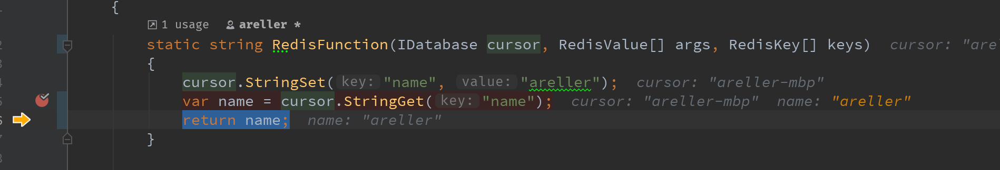

# Debugging



To use debugging, you would pass a debugging `TCursor` instance to `Client<TCursor>`.  

```C#
class Program
{
    static async Task Main(string[] args)
    {
        var connection = await ConnectionMultiplexer.ConnectAsync("localhost");
        var db = connection.GetDatabase(0);
        var client = new Client<IDatabase>(db, db); // First argument is for uploading the Lua script, the second is for debugging
    }
}
```  

RediSharp will automatically detect when the debugger is attached and will run your function in debug mode accordingly.  

*Note: In debug mode, your function will still be translated to Lua and uploaded to Redis. This is for catching compiling errors early on*

## SEClient
You can use `SEClient` as a shortcut for `Client<IDatabase>`. 

```C#
class Program
{
    static async Task Main(string[] args)
    {
        var connection = await ConnectionMultiplexer.ConnectAsync("localhost");
        var db = connection.GetDatabase(0);
        var client = new SEClient(db); // You don't have to pass the cursor twice.
    }
}
``` 

*Note: SEClient inherits from Client\<IDatabase\>*

## Disable Debugging

If for any reason you need to disable debugging (when in debug mode), you can initialize `Client<IDatabase>` or `SEClient` with `DebuggingEnabled` set to `false`.  

```C#
class Program
{
    static async Task Main(string[] args)
    {
        var connection = await ConnectionMultiplexer.ConnectAsync("localhost");
        var db = connection.GetDatabase(0);
        var client = new SEClient(db) { DebuggingEnabled = false };
    }
}
``` 